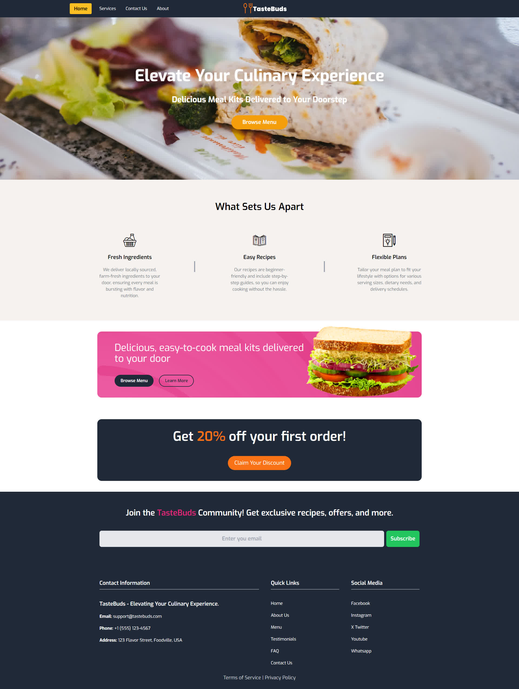

<div>
    <p align='center'>
        
    </p>
</div>

# TasteBuds

Landing page for a food delivery service

## Screenshot
<p align='center'>
    
</p>

## Requirements

* NPM
* PHP

## How to use

Install Dependencies

```
    npm i
```

Build 

```
    npm run build
```

Serve

```
    npm run serve
```

## Thanks To

* [Tailwind CSS](https://tailwindcss.com/)
* [SVG Backgrounds](https://www.svgbackgrounds.com/)
* [IcoMoon](https://icomoon.io/)
* [LogoAI](https://www.logoai.com/)

